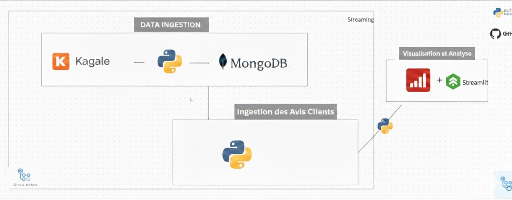
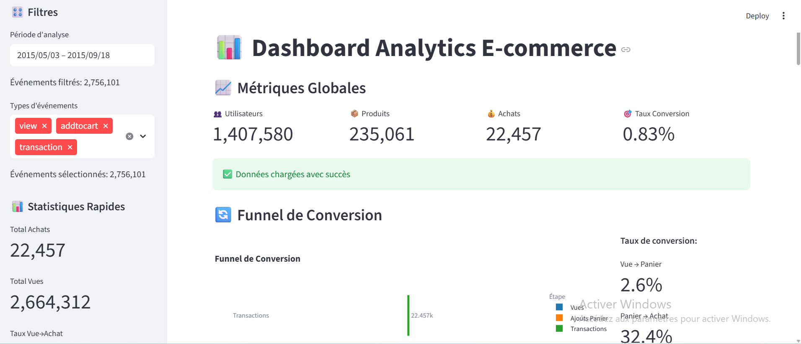

# E-Commerce Analytics Dashboard

Un projet complet d'analyse de données e-commerce utilisant le dataset RetailRocket pour analyser le comportement des utilisateurs, effectuer des tests A/B et créer un tableau de bord interactif.

## Description du Projet

Ce projet analyse les données de navigation e-commerce de RetailRocket pour comprendre le comportement des utilisateurs, optimiser les taux de conversion et effectuer des tests A/B sur différentes variantes d'interface. Le projet comprend trois composants principaux :

- **Traitement des données** : Nettoyage, analyse exploratoire et segmentation RFM
- **Tests A/B** : Évaluation d'impact des variantes d'interface sur le comportement utilisateur
- **Dashboard interactif** : Visualisation des métriques clés avec Streamlit

## Fonctionnalités

### Analyse de Données
- **Métriques globales** : Utilisateurs uniques, produits, transactions, taux de conversion
- **Funnel de conversion** : Analyse du parcours client (vue → panier → achat)
- **Analyse temporelle** : Activité par heure, jour de la semaine
- **Segmentation RFM** : Classification des clients par Récence, Fréquence, Montant
- **Analyse des abandons** : Produits fréquemment abandonnés dans le panier

### Tests A/B
- **Test global** : Comparaison des performances A vs B
- **Tests par catégorie** : Impact sur les grandes et sous-catégories
- **Tests temporels** : Performance selon l'heure et le jour
- **Analyse UX** : Évaluation des interfaces sur le parcours utilisateur

### Dashboard Interactif
- **KPIs principaux** : Métriques essentielles en temps réel
- **Visualisations avancées** : Graphiques Plotly interactifs
- **Filtres dynamiques** : Analyse par période, type d'événement
- **Aperçu des données** : Exploration des datasets nettoyés
- **Export de métriques** : Téléchargement des résultats

## Technologies Utilisées

- **Python** : Langage principal
- **Pandas** : Manipulation et analyse des données
- **Streamlit** : Interface web interactive
- **Plotly** : Visualisations avancées
- **MongoDB** : Stockage des données
- **Jupyter Notebook** : Analyses exploratoires
- **Scipy/Statsmodels** : Tests statistiques A/B

## Installation

### Prérequis
- Python 3.8+
- MongoDB (local ou cloud)
- Git

### Installation des Dépendances

1. **Cloner le repository**
```bash
git clone <https://github.com/abdoulaziz03/data_projet.git>
cd data_projet
```

2. **Créer un environnement virtuel**
```bash
python -m venv venv
source venv/bin/activate  # Sur Windows: venv\Scripts\activate
```

3. **Installer les packages**
```bash
pip install -r requirements.txt
```

4. **Configuration MongoDB**
Créer un fichier `.env` à la racine :
```env
MONGODB_URI=mongodb://localhost:27017/
MONGODB_DB_NAME=votre_base_donnees
```

## Utilisation

### 1. Préparation des Données

```bash
# Lancer le notebook de traitement des données
jupyter notebook Notebook/traitement.ipynb
```

Ce notebook effectue :
- Chargement des données brutes
- Nettoyage et transformation
- Analyses exploratoires
- Segmentation RFM
- Sauvegarde des données nettoyées

### 2. Tests A/B

```bash
# Lancer l'analyse A/B
jupyter notebook Notebook/ABtesting.ipynb
```

Analyses disponibles :
- Tests globaux de performance
- Tests par catégorie produit
- Tests temporels
- Analyse des abandons de panier

### 3. Dashboard Interactif

```bash
# Lancer le dashboard Streamlit
streamlit run code/streamlit.py
```

Accéder à `http://localhost:8501` pour explorer :
- Métriques en temps réel
- Visualisations interactives
- Filtres et segments
- Export des données

### 4. Intégration MongoDB

```bash
# Insérer les données nettoyées dans MongoDB
python data_collection/insertion_versmongo.py
```

## Structure du Projet et Schéma d'architecture

```
data_projet/
├── .gitignore
├── README.md
├── requirements.txt
├── code/
│   └── streamlit.py              # Dashboard principal
├── data/                         # Données (brutes et nettoyées)
├── data_collection/
│   └── insertion_versmongo.py    # Script d'insertion MongoDB
├── images/
│   ├── image1.png                # Schéma d'architecture
│   └── image2.png                # Visualisation des données
├── Notebook/
│   ├── traitement.ipynb          # Analyse et nettoyage des données
│   └── ABtesting.ipynb           # Tests A/B
└── src/
    ├── insertion.py              # Code source additionnel
    └── test_mongo.py             # Test MongoDB
```

## Schéma de l'architecture


## Jeux de Données

Le projet utilise le dataset **RetailRocket E-commerce** :
- **Events** : 2.7M+ événements utilisateur (vues, ajouts panier, achats)
- **Category Tree** : Hiérarchie des catégories produits
- **Item Properties** : Propriétés détaillées des produits

### Métriques Clés
- **2,756,101** événements utilisateur
- **1,407,580** visiteurs uniques
- **235,061** produits catalogués
- **11,359** transactions
- Période : Mai-Juillet 2015

## Analyses Disponibles

### Métriques Globales
- Taux de conversion : 0.41%
- Sessions/visiteur moyen : 2.0
- Heure de pointe : 20h
- Jour le plus actif : Vendredi

### Segmentation Client
- **Champions** : Clients récents, fréquents et à forte valeur
- **Nouveaux Clients** : Récemment acquis
- **Clients à Risque** : Anciens clients inactifs
- **Clients Perdus** : Inactifs depuis longtemps

### Tests A/B
- Comparaison de variantes d'interface
- Impact sur le taux de conversion
- Analyse par segment et temporalité

## Visualisation des données avec streamlit 

Les données collectées et stockées dans MongoDB sont analysées et visualisées via Tableau et Streamlit pour une exploration approfondie. Voici un aperçu des tableaux de bord créés.



## Conclusion

Ce projet d'analytics e-commerce a permis de transformer des données brutes complexes en insights stratégiques actionnables. En combinant traitement de données avancé, tests statistiques rigoureux et visualisation interactive, nous avons créé une plateforme complète pour la prise de décision data-driven.

## 📝 Licence

Ce projet est sous licence MIT - voir le fichier [LICENSE](LICENSE) pour plus de détails.

## 👥 Auteur

**Touré abdoul-aziz** 


---

